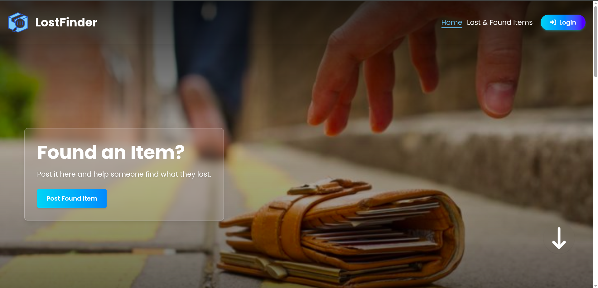

# 📍 LostFinder - Lost & Found Items Platform



---

## 🚀 Project Overview

**LostFinder** is a full-stack Lost and Found platform designed to connect people who have lost items with those who found them. Users can easily report lost or found belongings, browse posted items, and recover their valuables. This application emphasizes seamless user authentication, dynamic post management, and real-time updates, providing an intuitive experience on mobile, tablet, and desktop.

---

## 🌐 Live Demo

Check out the live site here:  
👉 [LostFinder Live](https://lostfinder-58605.web.app/)

---

## 💻 Technologies Used

- **Frontend:** React, React Router, Tailwind CSS, React Hook Form, Framer Motion  
- **Backend:** Node.js, Express.js, MongoDB  
- **Authentication:** Firebase Authentication (Email/Password + Google OAuth)  
- **State & Data Fetching:** React Query (TanStack Query), Axios  
- **Notifications:** React Toastify, SweetAlert2  
- **Other Libraries:** React Datepicker, JWT, dotenv

---

## ✨ Core Features

- User registration and login with email/password and Google OAuth  
- Secure JWT authentication with protected private routes  
- Add Lost or Found item posts with detailed info and image uploads  
- Browse, search, and filter lost & found items  
- View item details with conditional actions for recovery  
- Manage user-specific posts: update, delete, and mark recovered  
- Responsive design with polished UI/UX animations using Framer Motion  
- Dynamic page titles and smooth navigation  
- Robust error handling and 404 page  
- Toast notifications and sweet alerts for all CRUD operations  

---

## 📦 Main Dependencies

- react  
- react-router-dom  
- react-hook-form  
- @tanstack/react-query  
- axios  
- firebase  
- sweetalert2  
- react-toastify  
- react-datepicker  
- jsonwebtoken  
- express  
- mongoose  
- cors  
- dotenv  

---

## 🛠️ Setup & Run Locally

### Prerequisites

- Node.js (v16+)  
- npm or yarn  
- MongoDB Atlas or local MongoDB instance  
- Firebase project with Authentication enabled

### Installation Steps

1. **Clone the repositories:**

```bash
# Frontend
git clone https://github.com/codeSmith-006/Lostfinder-Client.git

# Backend
git clone https://github.com/codeSmith-006/Lostfinder-Server.git
